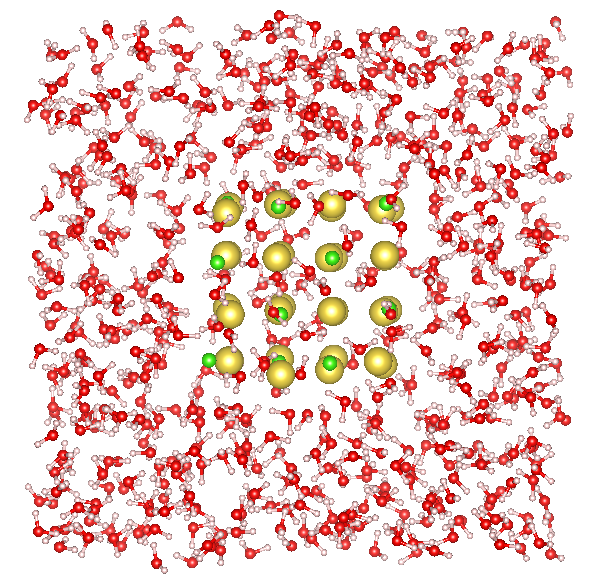

# Nequix Examples

Collection of example applications using the [Nequix foundation model](https://www.arxiv.org/abs/2508.16067). Suggestions welcome!

## NaCL Dissolution

See [`nacl-dissolution`](./nacl-dissolution/).

Dissolution of NaCL nanocrystal in water. Based on experiments from *Crumbling crystals: on the dissolution mechanism of
NaCl in water* [(O'Neill et al.)](https://doi.org/10.1039/D4CP03115F), repeated
in *A foundation model for atomistic materials chemistry* [(Batatia et al.)](https://arxiv.org/abs/2401.00096).

## Phonon Calculations

See [`phonon`](./phonon/).

Phonon bandstructure of Si with Nequix MP 1 and the PFT version introduced in [Phonon fine-tuning (PFT)](https://arxiv.org/abs/2601.07742).