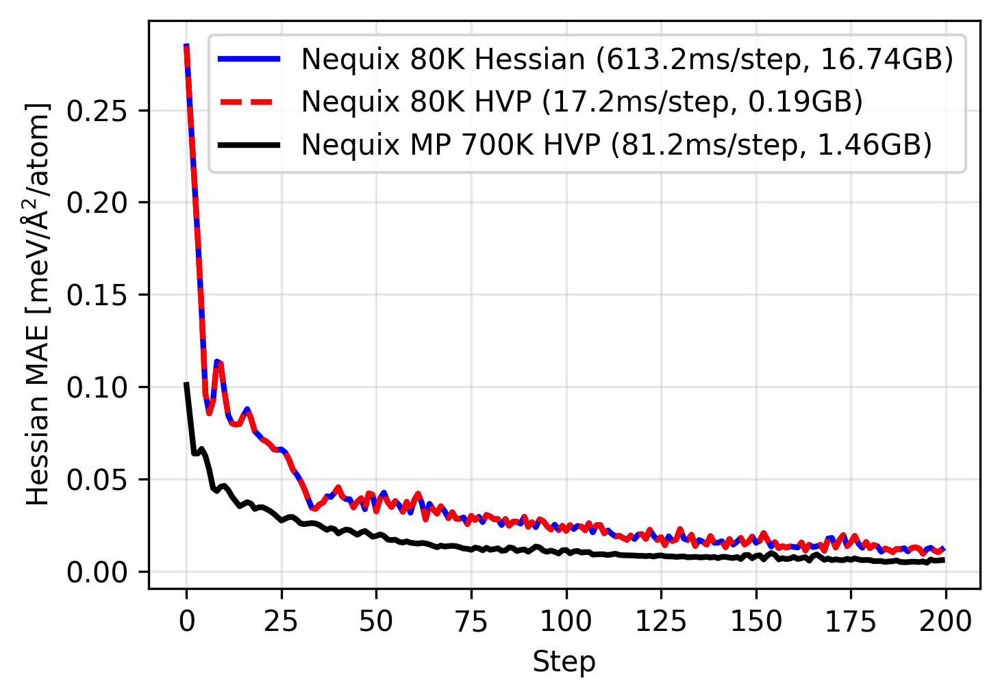

# PFT Demo



Example of how to train model with the force constant loss through stochastic HVP training, as discussed in [Phonon fine-tuning
(PFT)](https://arxiv.org/abs/2601.07742) and the associated [blog post](https://teddykoker.com/2026/02/pft/).

Run JAX demo:

```bash
uv run pft_jax.py
```

Run PyTorch demo:

```
uv run pft_torch.py
```

*NOTE: this example only implements the force constant loss term. For full PFT one should train on all of energy/force/stress/force constants as well as follow the cotraining procedure outlined in the paper, all of which can be found in the [full training code](https://github.com/atomicarchitects/nequix/blob/0c5ac960284eb85b54c9b5f5ca575c240aa47de3/nequix/pft/train.py).*