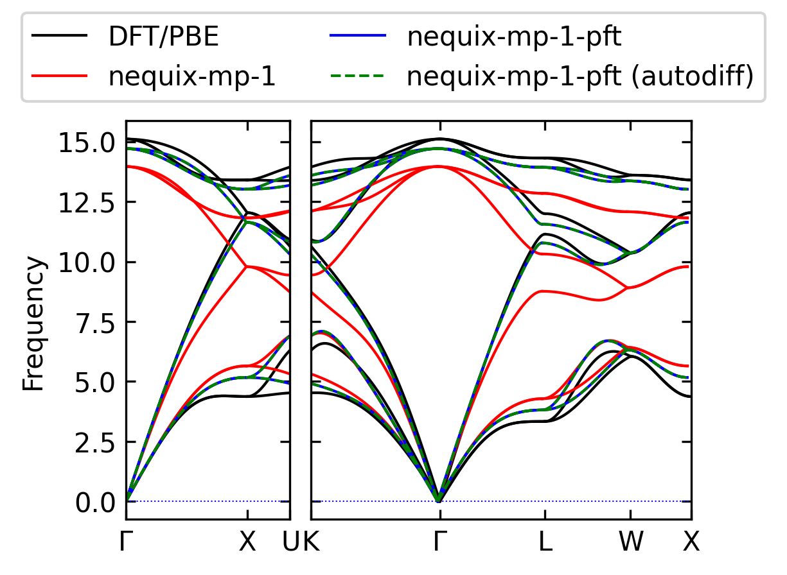

# Phonon calculations



Example of phonon calculations with `phonopy`, like how calculations were
performed in [PFT: Phonon Fine-tuning for Machine Learned Interatomic
Potentials](https://arxiv.org/abs/2601.07742). In the paper we follow
the relaxation protocol from
[here](https://github.com/hyllios/utils/blob/2d8b8ff801c7e90468e6556517571be1e7955832/benchmark_ph/umlip.py#L139)
as done by [Loew et al.](https://arxiv.org/abs/2412.16551).

Run with:

```bash
uv run phonon.py
```


It is shown `phonon.py` how to obtain force constants with finite
displacement:

```python
# calculate force constants using finite displacements
forcesets = []
ph_mlip.generate_displacements(distance=distance)
for supercell in ph_mlip.supercells_with_displacements:
    scell = Atoms(
        cell=supercell.cell,
        symbols=supercell.symbols,
        scaled_positions=supercell.scaled_positions,
        pbc=True,
    )
    scell.calc = NequixCalculator(model_name=model_name)
    forces = scell.get_forces()
    drift_force = forces.sum(axis=0)
    for force in forces:
        force -= drift_force / forces.shape[0]

    forcesets.append(forces)
ph_mlip.forces = forcesets
ph_mlip.produce_force_constants()
```

or with an analytical Hessian

```python
# calculate force constants using linearized Hessian
ase_supercell = Atoms(
    cell=ph_mlip.supercell.cell,
    symbols=ph_mlip.supercell.symbols,
    scaled_positions=ph_mlip.supercell.scaled_positions,
    pbc=True,
)
atom_indices = atomic_numbers_to_indices(ase_cell.calc.config["atomic_numbers"])
graph = dict_to_graphstuple(
    preprocess_graph(
        ase_supercell, atom_indices, ase_cell.calc.config["cutoff"], False
    )
)
hessian = hessian_linearized(ase_cell.calc.model, graph)
ph_mlip.force_constants = np.array(hessian, copy=True)
```

Note that the bandstructures computed through finite displacement and analytical
Hessian are nearly identical, however PFT improves agreement with DFT.